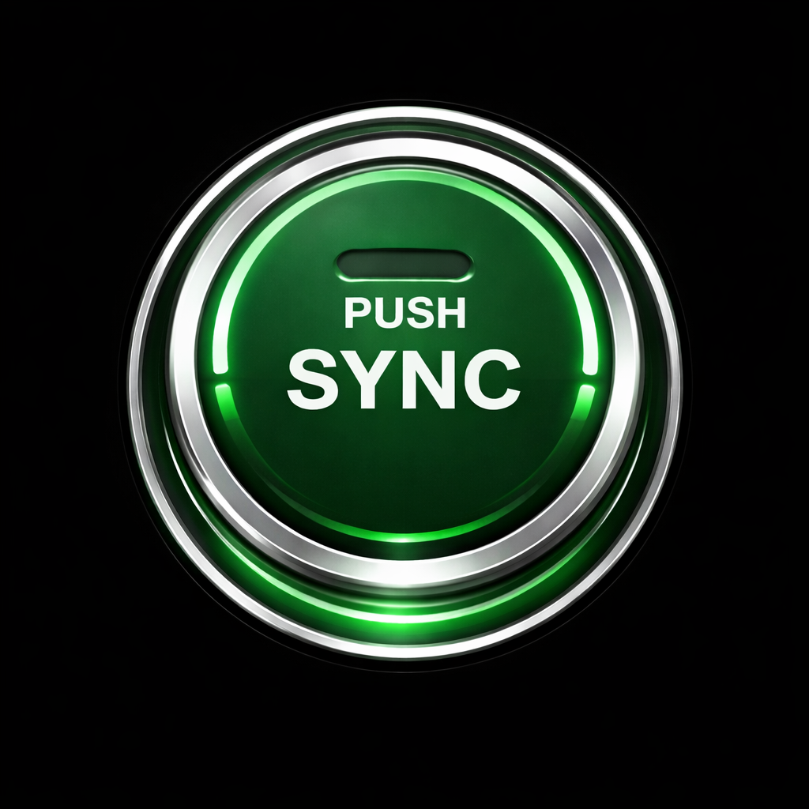

# SparkSync

SparkSync is an iOS app for connecting to remote machines over SSH, running a built-in terminal, and launching custom actions per device. This repository is the public-facing home for documentation, media, and curated custom-action templates.

## Highlights
- Connect to hosts over SSH with per-device settings.
- Built-in terminal experience for on-the-go work.
- Custom actions that open URLs or run scripts tied to a device.
- Device and custom data stay local to the device.

## What is included here
- Documentation and usage guides.
- Screenshots and demo videos.
- Predefined custom-action recipes.

## What is not included here
- App source code.
- Production credentials or user data.
- Any bundled devices or custom actions.

## Documentation
- Overview: `docs/overview.md`
- Features: `docs/features.md`
- Usage walkthrough: `docs/usage.md`
- Custom actions library: `docs/custom-actions.md`
- Privacy and data handling: `docs/privacy.md`
- Media checklist: `docs/media.md`
- FAQ: `docs/faq.md`

## Media
Place screenshots in `assets/screenshots` and videos in `assets/videos`. See `docs/media.md` for naming and capture notes.

## Predefined custom actions
A curated set of example custom actions is documented in `docs/custom-actions.md`. Each recipe is described in plain language so it can be recreated inside the app without importing code or data files.

## Support
If you need help or want to request a new custom-action recipe, open an issue in this repository.

## LinkedIn
https://ca.linkedin.com/in/ernest-namdar
